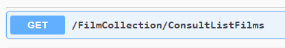
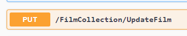
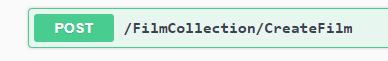
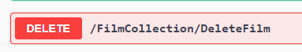

# StreamBerryAPI

Projeto desenvolvido para o desafio da empresa Keyworks de dev II. O intuito do StreamBerry é ser um sistema de gestão de acervo de filmes para facilitar a produção de novas obras.
## ✔️ Tecnologias utilizadas

- ``Net 6.0``
- ``Swagger UI``
- ``Banco de Dados SQL``
# :hammer: Endpoints

**Paginação valores padrões PageNumber = 0, PageSize = 20.**

 
`Parametros de entrada`: caso não seja informado os parametros de paginação será retornado com valor padrão.
 
`Retorno` : Lista com dados dos filmes paginados Ordem alfabetica (cada filme já contém sua nota média).

 
`Parametros de entrada`: **Title**, caso não seja informado os parametros de paginação será retornado com valor padrão.
 
`Retorno` : Lista com dados dos filmes com o titulo informado.

 
`Parametros de entrada`: **Year** (YYYY), caso não seja informado os parametros de paginação será retornado com valor padrão.
 
`Retorno` : Lista com dados dos filmes com o ano informado.

 
`Parametros de entrada`: **Rating** (valores de 1 a 5), caso não seja informado os parametros de paginação será retornado com valor padrão.
 
`Retorno` : Lista com dados dos filmes com a nota informada.

 
`Parametros de entrada`: **Genre** e **Year** (YYYY), caso não seja informado os parametros de paginação será retornado com valor padrão.
 
`Retorno` : Média das avaliações dos filmes com base no genero e ano informados além dos dados paginados em ordem alfabetica.

 
`Parametros de entrada`: **Id do filme e novos dados a serem inseridos**,
 
`Retorno` : Dados do novo filme alterado.

 
`Parametros de entrada`: **Filme e novos dados a serem inseridos**,
 
`Retorno` : Dados do novo filme alterado.

 
`Parametros de entrada`: **Id do filme**,
 
`Retorno` : mensagem de validação se o filme foi encontrado na base e conseguiu ser excluido.
